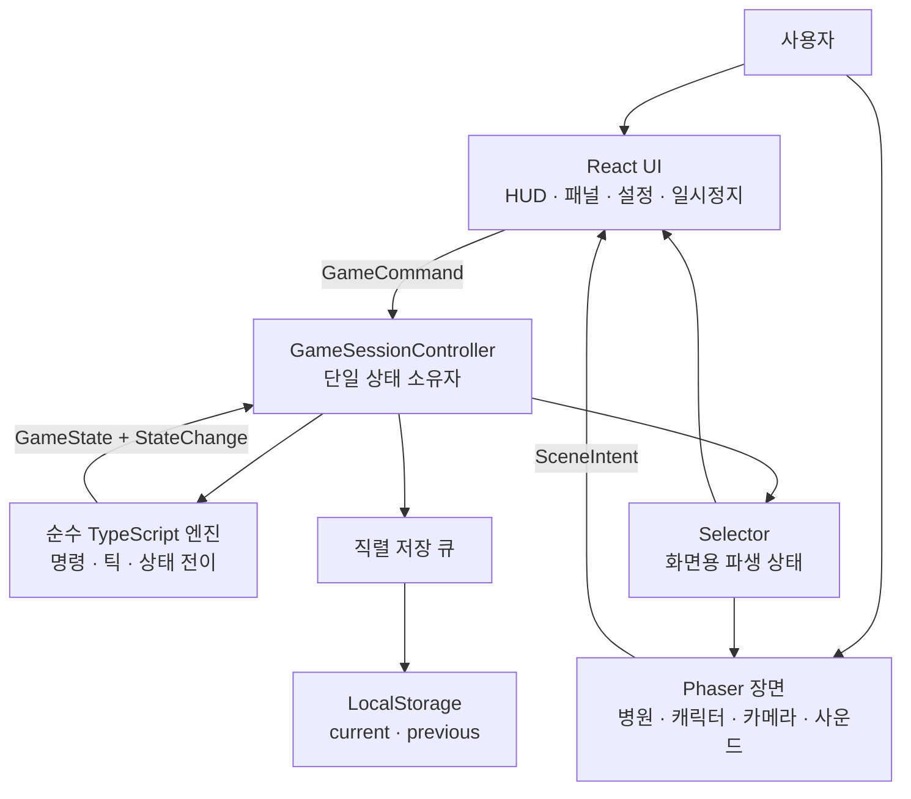

# Wait:ON 4일 플레이어블 프로토타입 설계

## 문서 정보

- 상태: 사용자 방향 승인 후 작성한 구현 전 설계안
- 대상: 5인 팀, 4일 발표용 모바일 웹 프로토타입
- 제품 기준: [`PROJECT_V2.md`](../../PROJECT_V2.md)
- 게임 규칙: [`GAMEPLAY.md`](../../GAMEPLAY.md)
- 기존 기술 기준: [`TECHNICAL_DESIGN.md`](../../TECHNICAL_DESIGN.md)
- 목적: React와 Phaser를 결합한 플레이어블 프로토타입의 범위, 계층 경계, 데이터 흐름, 팀 소유권과 검증 기준을 확정한다.

---

## 1. 결정 요약

프로토타입은 다음 기술 구성으로 제작한다.

```text
React + Phaser + TypeScript + Vite
```

각 기술의 책임은 겹치지 않게 분리한다.

| 영역 | 담당 기술 | 책임 |
|---|---|---|
| 게임 규칙 | 순수 TypeScript | 환자 흐름, 작업, 의료진 예약, 시간, 지표 |
| 게임 장면 | Phaser | 병원 단면, 캐릭터, 카메라, 트윈, 시각 효과, 사운드 재생 |
| 정보와 선택 UI | React | HUD, 부서 패널, 선택 확인, 안내, 설정, 일시정지, 이어하기 |
| 개발과 배포 | Vite | 개발 서버, 모듈 갱신, 정적 웹 빌드 |
| 저장 | 브라우저 저장 어댑터 | 현재·이전 저장본, 검증, 복구 |

React와 Phaser는 게임 상태를 직접 수정하지 않는다. 게임 상태 변경은 순수 TypeScript 엔진에 전달되는 명령을 통해서만 발생한다.

### 기존 문서와의 관계

이 설계가 최종 승인되면 다음 문서를 구현 전에 동기화한다.

- `TECHNICAL_DESIGN.md`의 React 단독 렌더링 구조를 React + Phaser 구조로 변경
- `PRODUCTION_PLAN.md`의 5일 일정을 4일 일정으로 변경
- 기존 React 단독 프로토타입 구현 계획에 `대체됨` 상태 표시
- 별도의 React + Phaser 구현 계획 작성

최종 승인 전에는 이 문서가 제안 설계이고, 승인 후에는 위 항목에 한해 기존 기술 설계와 제작 일정보다 우선한다. 제품 철학, 게임 규칙, 안전·윤리 기준은 변경하지 않는다.

---

## 2. 선택 근거

### 제품 요구사항

현재 문서에서 확인되는 요구사항은 다음과 같다.

- QR 또는 링크로 모바일 브라우저에서 즉시 실행
- 같은 상태와 입력이 같은 결과를 만드는 결정론적 시뮬레이션
- 사용자의 선택을 즉시 반영
- 자동 저장과 이어하기
- 고정된 병원 전체 화면
- 자유 드래그 카메라와 캐릭터 추적 카메라 제외
- 무음과 모션 줄이기 지원
- 대기 원인과 선택 결과를 텍스트로 설명

### 공식 기술 근거

- React는 게임 엔진이 아니라 컴포넌트 기반 UI 라이브러리다. HTML과 SVG, ARIA 속성을 사용할 수 있으므로 상태 정보와 접근 가능한 조작 UI에 적합하다.
  - [React UI 공식 문서](https://react.dev/learn/describing-the-ui)
  - [React DOM 공식 문서](https://react.dev/reference/react-dom/components)
- Phaser는 모바일과 데스크톱 브라우저용 2D 게임 프레임워크다. Canvas/WebGL 렌더링, 게임 루프, 장면, 입력, 카메라, 애니메이션, 물리와 사운드 시스템을 제공한다.
  - [Phaser 공식 문서](https://docs.phaser.io/)
  - [Phaser 장면](https://docs.phaser.io/phaser/concepts/scenes)
  - [Phaser 카메라](https://docs.phaser.io/phaser/concepts/cameras)
  - [Phaser 오디오](https://docs.phaser.io/phaser/concepts/audio)
- TypeScript 타입은 컴파일 후 제거된다. 따라서 개발 중 상태 계약을 검사하는 용도로 사용하고 저장 데이터는 별도로 런타임 검증한다.
  - [TypeScript 공식 문서](https://www.typescriptlang.org/docs/handbook/typescript-from-scratch)
- Vite는 개발 서버와 정적 프로덕션 번들을 제공하는 빌드 도구다. 게임 기능은 제공하지 않는다.
  - [Vite 공식 문서](https://vite.dev/guide/)
- Canvas는 대체 DOM이 없으면 접근성이 부족하므로 핵심 조작을 Phaser Canvas에만 두지 않는다.
  - [Canvas 접근성 설명](https://developer.mozilla.org/en-US/docs/Web/API/Canvas_API/Tutorial/Basic_usage.)

### 대안 판단

#### React 단독

운영 규칙과 정보 UI를 가장 빠르게 검증할 수 있지만 캐릭터 움직임, 장면 연출과 게임다운 반응을 모두 직접 구현해야 한다. 사용자가 “게임을 해본다”는 감각을 평가하기에는 부족할 가능성이 있어 채택하지 않는다.

#### Phaser 단독

게임 장면 제작에는 적합하지만 대기 원인, 선택 전 영향, 의료 안전 안내와 접근성 조작을 Canvas 위에 별도로 구현해야 한다. Wait:ON의 정보량을 고려해 채택하지 않는다.

#### Unity Web

2D·3D 장면 편집, 애니메이션, 오디오와 다중 플랫폼 제작에 적합하다. 그러나 현재 팀의 Unity 숙련도가 정해지지 않았고, 4일 프로토타입에서 요구하지 않는 기능까지 포함한다. 이번 프로토타입에서는 사용하지 않으며 장기 제작 전환 시 다시 평가한다.

#### React + Phaser

React가 정보와 접근성을, Phaser가 게임 장면과 반응성을 맡는다. 두 계층의 상태 동기화 비용은 생기지만, 단일 상태 소유자와 명령 경계를 두어 통제한다. 이번 목표에 가장 적합한 대안으로 채택한다.

---

## 3. 프로토타입 범위

### 반드시 포함

- 모바일 세로형 병원 단면
- 외래와 검사실
- 환자 3명
- 외래 의사 1명
- 검사 담당자 1명
- 외래와 검사실을 지원할 수 있는 순환 간호사 1명
- 외래 진료 → 검사 → 결과 확인 흐름
- 간호사 재배치와 5분 이동 작업
- 검사실 처리 개선과 외래 지원 중단이라는 명확한 장단점
- 병원 시각과 대기 인원
- 병목 부서와 원인
- 환자 만족도
- 일시정지
- 자동 저장과 이어하기
- 효과음 4종 이상
- 음소거
- 배경 전환 시 시간과 소리 정지
- 실제 의료 판단이 아니라는 안내

### 화면에는 보이지만 운영하지 않음

- 응급실
- 수술실
- 병상 현황

이 세 영역은 병원 단면의 배경 랜드마크로만 표시하고 `프로토타입 준비 중`이라고 명시한다. 버튼, 대기열과 이벤트는 제공하지 않는다.

### 이번 프로토타입에서 제외

- 1·2·6인실 병상 배정
- 응급실과 수술실의 실제 운영
- 이벤트 6종
- 9분 전체 하루
- 운영 디렉터
- 셔플백 무작위
- 피로도 휴식 명령
- 서버, 계정과 클라우드 저장
- 실제 환자 데이터
- 네트워크 멀티플레이
- 오프라인 설치형 앱

제외된 기능은 아키텍처에서 막지 않지만 4일 일정에는 구현하지 않는다.

---

## 4. 시스템 아키텍처



### 단일 상태 소유자

`GameSessionController`만 현재 `GameState`를 보유한다.

- React는 controller를 구독하고 `GameUiViewModel`을 렌더링한다.
- Phaser는 controller를 구독하고 `HospitalSceneViewModel`을 렌더링한다.
- React만 확인된 `GameCommand`를 controller에 보낸다.
- Phaser는 React에 `SceneIntent`를 보내 부서 패널이나 배치 확인 화면을 연다.
- React state와 Phaser registry에 별도의 게임 상태 복사본을 만들지 않는다.
- Phaser의 좌표, 트윈 진행률과 파티클은 표현 상태이며 `GameState`가 아니다.

### 시뮬레이션과 렌더링 시간 분리

- 시뮬레이션은 현실 시간 1초마다 고정된 게임 시간 1분을 진행한다.
- 2배속은 동일한 1분 틱을 두 번 호출한다.
- Phaser 렌더링 프레임은 시뮬레이션 시간을 진행하지 않는다.
- Phaser는 이전과 다음 뷰모델 사이를 시각적으로 보간한다.
- 브라우저가 숨겨지면 controller가 시뮬레이션을 일시정지한다.
- 복귀 후 사용자가 `계속하기`를 눌러야 다시 진행한다.

이 구조로 렌더링 프레임 수가 달라도 게임 결과는 동일하게 유지한다.

---

## 5. 게임 엔진

### 상태

게임 상태에는 직렬화할 수 있는 값만 저장한다.

```ts
type GameState = {
  schemaVersion: 1
  scenarioId: "prototype-outpatient-lab"
  randomSeed: number
  gameTime: number
  speed: 0 | 1 | 2
  phase: "playing" | "paused" | "result"
  patients: Record<string, Patient>
  staff: Record<string, Staff>
  departments: Record<string, Department>
  tasks: Record<string, Task>
  metrics: Metrics
  changes: StateChange[]
}
```

다음 값은 게임 상태에 저장하지 않는다.

- Phaser Scene과 Game Object
- Sprite, Texture와 Sound 객체
- React component state
- DOM 객체
- 타이머 ID
- 함수
- 현실 시각 객체

### 명령

```ts
type GameCommand =
  | AssignStaffCommand
  | SetSpeedCommand
  | PauseCommand
  | ResumeCommand
```

명령은 `commandId`를 포함한다. 엔진은 명령을 검증한 뒤 승인된 다음 상태, 변화 기록과 거절 이유를 반환한다.

### 틱

`advanceOneMinute(state)`는 다음 순서를 고정한다.

1. 시각 증가
2. 환자 도착
3. 실행 작업 진행
4. 작업 완료
5. 예약 자원 해제
6. 다음 환자 작업 생성
7. 의료진 이동 완료
8. 차단 작업 재평가
9. 우선순위 정렬
10. 원자적 자원 예약
11. 대기와 만족도 변화
12. 지표와 변화 기록 갱신

### 자원 예약

- 필요한 의료진을 전부 찾은 뒤 한 번에 예약한다.
- 하나라도 부족하면 어떤 의료진도 변경하지 않는다.
- 같은 의료진을 두 작업에 예약하지 않는다.
- 후보 ID를 정렬해 같은 상태에서 같은 결과를 보장한다.

---

## 6. React UI

React는 다음 화면을 담당한다.

- 시작 화면
- 이어하기
- 상단 HUD
- 현재 병원 시각
- 대기시간과 만족도
- 부서 상세 패널
- 간호사 배치 예상 영향
- 배치 확정
- 상태 변화 피드백
- 일시정지 오버레이
- 음소거와 볼륨
- 저장 상태
- 의료 안전 안내

### 접근성 원칙

- 모든 게임 결정에는 HTML `button` 대안을 제공한다.
- Phaser 부서 오브젝트를 누르는 것과 React 부서 버튼은 같은 패널을 연다.
- 색상만으로 혼잡, 위험과 완료 상태를 전달하지 않는다.
- 사운드만으로 중요한 상태를 전달하지 않는다.
- 모션 줄이기 설정에서는 카메라 트윈과 반복 장식을 제거한다.
- 최소 44px 터치 영역을 사용한다.
- 키보드 포커스를 표시한다.

---

## 7. Phaser 게임 장면

### 장면 구성

```text
BootScene
  → 자산 등록과 최소 로딩 화면

HospitalScene
  → 병원 단면
  → 외래와 검사실 랜드마크
  → 환자와 의료진 스프라이트
  → 이동 트윈
  → 혼잡·완료 시각 효과

AudioScene 또는 전역 Sound Manager
  → 배경음과 효과음
```

발표용 프로토타입에서는 Scene 수를 더 늘리지 않는다.

### 장면 데이터

Phaser는 `HospitalSceneViewModel`만 입력받는다.

```ts
type HospitalSceneViewModel = {
  gameTime: number
  phase: "playing" | "paused" | "result"
  departments: DepartmentSceneModel[]
  patients: PatientSceneModel[]
  staff: StaffSceneModel[]
  feedback: SceneFeedback[]
}
```

Scene은 환자 상태를 결정하지 않는다. 새 뷰모델이 들어오면 기존 오브젝트를 ID로 찾고 생성, 갱신 또는 제거한다.

### 카메라

- 기본은 병원 전체 고정 화면이다.
- 부서를 선택하면 0.25~0.4초 동안 제한된 확대와 이동을 사용한다.
- 환자나 의료진을 계속 추적하지 않는다.
- 한 번의 조작으로 전체 화면에 복귀한다.
- 모션 줄이기에서는 즉시 전환한다.

---

## 8. React–Phaser 브리지

브리지는 다음 네 기능만 제공한다.

```ts
interface GameBridge {
  mount(container: HTMLElement): void
  render(viewModel: HospitalSceneViewModel): void
  setAudioSettings(settings: AudioSettings): void
  destroy(): void
}
```

Phaser에서 React로 전달하는 이벤트:

```ts
type SceneIntent =
  | { type: "focus-department"; departmentId: string }
  | { type: "request-staff-assignment"; staffId: string; departmentId: string }
  | { type: "resume-audio" }
```

경계 규칙:

- 브리지는 `GameState`를 변경하지 않는다.
- `focus-department`는 UI 선택이며 게임 명령이 아니다.
- 실제 배치 명령은 React 확인 화면을 통과한 뒤 controller에 전달한다.
- 브리지는 전역 이벤트 버스를 사용하지 않는다.
- React 재렌더링 때 Phaser Game을 다시 생성하지 않는다.
- 앱 종료 시 `destroy()`로 Scene, 타이머와 오디오를 해제한다.

---

## 9. 사운드

### 사운드 범위

| cue | 용도 |
|---|---|
| `ui.confirm` | 선택 확정 |
| `task.complete` | 진료 또는 검사 완료 |
| `staff.move` | 의료진 이동 시작 |
| `bottleneck.notice` | 병목 변화 안내 |
| `ambient.day` | 낮은 강도의 병원 환경음 |

### 처리 구조

게임 엔진은 음원 파일명을 알지 못한다.

```text
StateChange
  → AudioCueMapper
  → cue key
  → Phaser Sound Manager
  → 실제 음원
```

### 사운드 안전 원칙

- 실제 병원 호출음과 비슷한 음원을 사용하지 않는다.
- 심전도, 응급 경보와 사이렌을 사용하지 않는다.
- 첫 사용자 탭 이후에만 오디오를 활성화한다.
- 음소거를 항상 표시한다.
- 설정을 저장한다.
- 백그라운드에서 모든 반복음을 정지한다.
- 음원 재생 실패는 게임 진행을 막지 않는다.
- 무음 상태에서도 같은 정보를 텍스트와 시각 피드백으로 제공한다.

브라우저 자동재생 정책 때문에 첫 사용자 입력 전의 소리 재생을 성공 조건으로 두지 않는다.

---

## 10. 저장과 복구

### 저장 대상

- 게임 시각과 속도
- 환자와 의료진 상태
- 실행·대기·차단 작업
- 작업 남은 시간
- 지표
- 튜토리얼 진행
- 사운드 설정

Phaser 표현 상태는 저장하지 않는다. 복귀 시 게임 상태에서 장면을 다시 구성한다.

게임 상태와 사용자 설정은 다음 저장 payload로 함께 보관한다.

```ts
type SessionSaveData = {
  gameState: GameState
  settings: {
    muted: boolean
    masterVolume: number
    reducedMotion: boolean
  }
}
```

사운드와 모션 설정은 게임 규칙에 영향을 주지 않으므로 `GameState` 내부에는 넣지 않는다.

### 저장 슬롯

- `waiton.save.current`
- `waiton.save.previous`

### 저장 규칙

- 승인된 명령 직후 저장 요청
- 주요 작업 완료 직후 저장 요청
- 15초마다 저장 요청
- 일시정지, `visibilitychange`, `pagehide`와 `잠시 나가기`에서 저장 요청
- 저장은 동시에 하나만 실행
- 저장 중 새 요청이 오면 가장 최신 상태 하나만 대기
- 현재 저장본이 손상되면 이전 저장본 시도
- 저장 실패가 현재 플레이를 되돌리지 않음

`localStorage`는 동기식이므로 controller가 직접 호출하지 않고 어댑터와 저장 큐 뒤에 둔다. 프로토타입 상태가 커지면 같은 인터페이스의 IndexedDB 어댑터로 교체한다.

---

## 11. 오류 처리

### Phaser 초기화 실패

- React 화면은 유지한다.
- `게임 장면을 불러오지 못했습니다.`와 재시도 버튼을 표시한다.
- 저장 데이터를 삭제하지 않는다.

### 사운드 실패

- 게임은 무음으로 계속 진행한다.
- 음소거 아이콘에 사용 불가 상태를 표시한다.
- 반복 재시도로 사용자를 방해하지 않는다.

### 저장 실패

- 메모리 상태와 게임 진행은 유지한다.
- 저장 실패를 비차단 배너로 알린다.
- 다음 저장 시 다시 시도한다.
- 이전 정상 저장본을 삭제하지 않는다.

### 잘못된 명령

- 상태를 변경하지 않는다.
- 실행할 수 없는 이유와 가능한 다음 행동을 React 패널에 표시한다.

---

## 12. 테스트 전략

### 자동 테스트

#### 게임 엔진

- 환자 경로
- 1분 틱 순서
- 의료진 원자적 예약
- 간호사 재배치의 양쪽 영향
- 지표 범위
- 일시정지
- 같은 입력의 같은 결과

#### controller

- 승인 명령 직후 상태 반영
- 저장 중 최신 상태 직렬화
- 백그라운드 일시정지
- 저장 실패 비차단

#### 저장

- 전체 상태 왕복
- 손상된 현재 저장본
- 이전 저장본 복구
- 지원하지 않는 버전 거절

#### React

- 배치 전 장점과 주의점
- 접근 가능한 버튼
- 일시정지와 이어하기
- 저장과 오디오 상태

### 브라우저 수동 테스트

- iOS Safari 16.4 이상
- Android Chrome 111 이상
- 390×844 세로 화면
- 첫 탭 후 오디오 활성화
- 백그라운드 전환
- 새로고침 후 이어하기
- 모션 줄이기
- 무음 완주
- 최소 30fps 유지 여부 기록

브라우저 버전은 Vite 기본 프로덕션 대상에 맞춘 프로토타입 검증 범위다. 실제 병원 도입 전에는 대상 기기 조사를 거쳐 지원 범위를 다시 정한다.

---

## 13. 5인 역할과 코드 소유권

### 1. 프로덕트·게임기획 리드

소유:

- 프로토타입 범위
- 게임 규칙과 수치
- 시나리오 데이터
- 피드백 문구
- 의료안전 기준
- 당일 범위 축소 결정

다른 역할의 코드를 직접 소유하지 않지만 `GameCommand`, 환자 경로와 평가 규칙 변경을 승인한다.

### 2. 시뮬레이션 개발자

소유:

- `src/game/model`
- `src/game/scenario`
- `src/game/scheduler`
- `src/game/engine`
- `src/game/selectors`
- 엔진 단위 테스트

Phaser와 React를 import하지 않는다.

### 3. 클라이언트·통합 개발자

소유:

- `GameSessionController`
- React 앱
- React–Phaser 브리지
- 저장 어댑터
- 빌드와 배포
- 통합 테스트

게임 규칙을 React와 Phaser에 복제하지 않는다.

### 4. UX·비주얼·사운드 디자이너

소유:

- 모바일 화면 구조
- 병원 단면
- 부서 랜드마크
- 환자와 의료진 에셋
- 트윈·상태 효과 명세
- 효과음과 환경음
- 오디오 cue 목록
- 모션 줄이기와 무음 표현

실제 병원 표식, 호출음과 경보음을 임의로 사용하지 않는다.

### 5. QA·플레이테스트·발표 담당

소유:

- 수용 기준
- 모바일 테스트 매트릭스
- 저장·복구 시나리오
- 의료 오인 점검
- 버그 우선순위
- 발표 시나리오
- 비상용 데모 녹화

1일차부터 테스트를 작성하며 마지막 날에 처음 참여하지 않는다.

### 공동 검토가 필요한 계약

| 변경 | 필수 검토자 |
|---|---|
| `GameState`, `GameCommand` | 게임기획, 시뮬레이션, 통합 |
| React–Phaser 브리지 | 시뮬레이션, 통합 |
| 환자·의료진 표현 | 게임기획, UX |
| 의료 문구·사운드 | 게임기획, UX, QA |
| 저장 스키마 | 시뮬레이션, 통합, QA |

---

## 14. 4일 제작 일정

### 1일차: 움직이는 뼈대

공통 완료 목표:

- 모바일 링크에서 병원 단면이 열린다.
- 환자 한 명이 외래로 이동한다.
- 순수 엔진에서 외래 작업이 진행된다.

병렬 작업:

- 기획: 환자 3명과 수치 확정
- 시뮬레이션: 상태 모델, 첫 환자 흐름, 테스트
- 통합: Vite, React, Phaser, controller와 브리지 초기화
- UX: 병원 단면, 외래·검사실, 임시 캐릭터와 cue 초안
- QA: 수용 기준, 기기 목록, 첫 스모크 테스트

### 2일차: 닫힌 게임 루프

공통 완료 목표:

- 외래 → 검사 → 결과 확인이 끝난다.
- 간호사 재배치의 이득과 손실이 보인다.
- 효과음과 즉시 피드백이 동작한다.

병렬 작업:

- 시뮬레이션: 작업 큐, 예약, 지표
- 통합: React 선택 패널, Phaser 동기화
- UX: 이동, 완료, 병목 표현과 음원
- QA: 결정론, 중복 예약, 모바일 입력 검증
- 기획: 수치 조정과 문구 검수

### 3일차: 저장·복귀와 사용자 경험

공통 완료 목표:

- 일시정지, 잠시 나가기와 이어하기가 동작한다.
- 모바일에서 처음부터 끝까지 플레이할 수 있다.

작업:

- 저장 current/previous와 손상 복구
- 배경 전환 시 게임·사운드 정지
- 튜토리얼 한 단계
- 모션 줄이기
- 무음 완주
- 첫 내부 플레이테스트

3일차 오후부터 신규 핵심 기능을 추가하지 않는다.

### 4일차: 동결·검증·발표

허용 작업:

- S0 진행 불가 버그
- S1 주요 기능·오인·저장 버그
- 가독성과 음량 조정
- 발표 시나리오 안정화

금지 작업:

- 새 부서
- 새 이벤트
- 새 지표
- 아키텍처 변경
- 대규모 에셋 교체

최종 산출물:

- 배포 URL
- 자동 테스트 결과
- iOS·Android 테스트 결과
- 알려진 제한 목록
- 3~5분 발표 시나리오
- 네트워크 또는 기기 실패에 대비한 녹화본

---

## 15. 협업 규칙

- 각 역할은 소유 폴더를 우선 수정한다.
- 다른 역할의 소유 파일을 수정하기 전에 담당자에게 알린다.
- 브랜치는 반나절보다 오래 유지하지 않는다.
- 1일차부터 매일 13시와 18시에 통합 빌드를 만든다.
- `GameState`와 브리지 계약 변경은 통합 시간 전에 공유한다.
- 임시 에셋도 최종 이름 규칙을 사용한다.
- 막힌 작업은 30분 안에 공개하고 범위를 줄이거나 지원을 요청한다.
- 3일차 오후 이후에는 QA 담당자가 버그 우선순위를 관리한다.

### 의사결정권

- 제품 범위와 의료 표현: 프로덕트·게임기획 리드
- 엔진 무결성과 상태 계약: 시뮬레이션 개발자
- 통합, 저장과 배포: 클라이언트·통합 개발자
- 시각·모션·사운드: UX·비주얼·사운드 디자이너
- 출시 차단 여부: QA 담당자와 프로덕트 리드 공동

의견이 갈리고 30분 안에 해결되지 않으면 4일 목표를 더 잘 보존하는 작은 범위를 선택한다.

---

## 16. 완료 조건

다음 조건을 모두 만족하면 발표용 프로토타입을 완료한 것으로 본다.

- 링크로 모바일 브라우저에서 실행된다.
- 병원 단면에 환자와 의료진이 움직인다.
- 외래 → 검사 → 결과 확인 흐름이 완료된다.
- 간호사 재배치의 이득과 손실이 모두 표시된다.
- 선택이 대기시간과 만족도에 영향을 준다.
- 같은 초기 상태와 명령은 같은 결과를 만든다.
- 의료진이 두 작업에 중복 예약되지 않는다.
- 병목 원인이 텍스트로 표시된다.
- 무음으로 전체 플레이가 가능하다.
- 첫 사용자 입력 후 효과음이 동작한다.
- 음소거와 모션 줄이기가 동작한다.
- 일시정지 중 게임 시간이 흐르지 않는다.
- 새로고침 후 이어하기가 가능하다.
- 최신 저장본 손상 시 이전 저장본을 시도한다.
- 실제 의료 판단 또는 실제 환자정보를 사용하지 않는다.
- iOS Safari와 Android Chrome 수동 테스트 결과가 기록된다.
- 발표용 3~5분 시나리오를 중단 없이 완주한다.

---

## 17. 장기 전환 기준

프로토타입 이후 다음 조건 중 하나가 확인되면 기술 구성을 다시 평가한다.

### Phaser 유지

- 웹 링크 배포가 핵심 채널
- 2D 병원 단면이 유지
- 텍스트와 접근성 UI 비중이 큼
- 현재 렌더링 성능이 목표 기기에서 충분

### Unity 또는 Godot 검토

- 네이티브 앱스토어 배포가 핵심 채널
- 3D 병원 또는 복잡한 공간 편집이 필요
- 애니메이션 제작 파이프라인이 프로젝트의 중심
- 대규모 에셋과 전문 게임 개발 인력이 투입
- 콘솔 또는 데스크톱 패키지 출시가 요구

기술 전환 여부는 “게임이라서 Unity”가 아니라 배포 채널, 장면 복잡도, 팀 역량과 실제 프로토타입 측정 결과로 결정한다.
